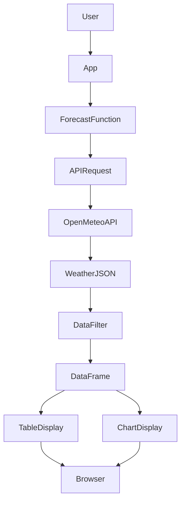
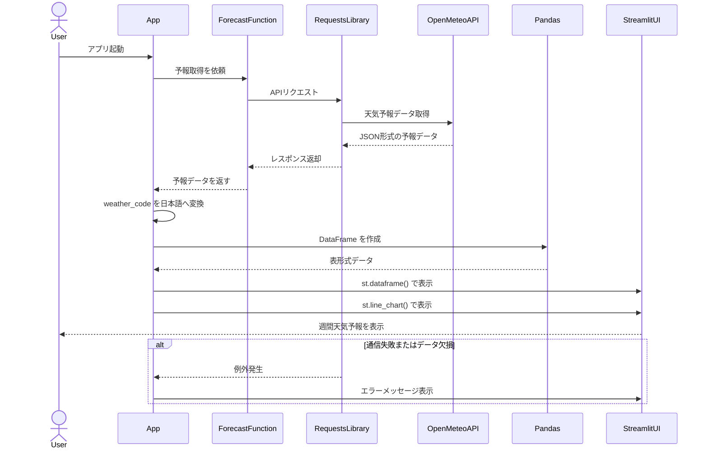

## 概要図

```mermaid
flowchart TD
    User --> App
    App --> ForecastFunction
    ForecastFunction --> APIRequest
    APIRequest --> OpenMeteoAPI
    OpenMeteoAPI --> WeatherJSON
    WeatherJSON --> DataFilter
    DataFilter --> DataFrame
    DataFrame --> TableDisplay
    DataFrame --> ChartDisplay
    TableDisplay --> Browser
    ChartDisplay --> Browser
```

## シーケンス図

```mermaid
sequenceDiagram
    actor User
    participant App
    participant ForecastFunction
    participant RequestsLibrary
    participant OpenMeteoAPI
    participant Pandas
    participant StreamlitUI

    User->>App: アプリ起動
    App->>ForecastFunction: 予報取得を依頼
    ForecastFunction->>RequestsLibrary: APIリクエスト
    RequestsLibrary->>OpenMeteoAPI: 天気予報データ取得
    OpenMeteoAPI-->>RequestsLibrary: JSON形式の予報データ
    RequestsLibrary-->>ForecastFunction: レスポンス返却
    ForecastFunction-->>App: 予報データを返す

    App->>App: weather_code を日本語へ変換
    App->>Pandas: DataFrame を作成
    Pandas-->>App: 表形式データ
    App->>StreamlitUI: st.dataframe() で表示
    App->>StreamlitUI: st.line_chart() で表示
    StreamlitUI-->>User: 週間天気予報を表示

    alt 通信失敗またはデータ欠損
        RequestsLibrary-->>App: 例外発生
        App->>StreamlitUI: エラーメッセージ表示
    end
```